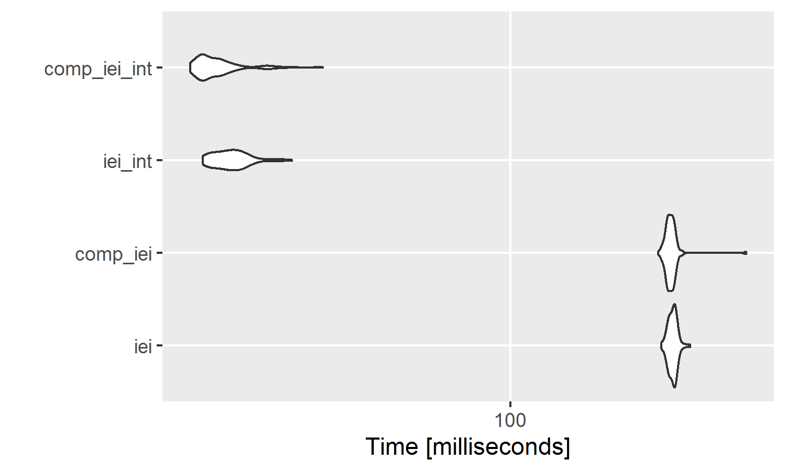

# Fast independent event identifier or how to use recursive functions

The following introduces a small code snippet that calculates the count-bids as Grigory defined it.

Grigory's definition includes the following. Given we have a data.frame of companies and dates, we want to find dates that are 60 days apart, however, the catch is, that once a date is identified, this date blocks the next 60 dates, another entry at the 61$^{st}$ day will be counted again, regardless of other dates in between. Also, the first day is always chosen. The given example shows Abigail's Jewelry Inc and the five respective events. Of these five events the first is independent as it is the first event for the company (group) and is counted as 1. With a gap of 16 days, the second date is below the threshhold and is thus marked as dependent (counted as 0). The third event is still less than 60 days from the first counted with a difference of 31 days, as is the fourth event with 32 days. The last event has a distance of 74, therefore it is regarded as independent.


```
##                     comp       date  daydif
## 1: Abigail's Jewelry Inc 2009-05-15 16 days
## 2: Abigail's Jewelry Inc 2009-05-31 15 days
## 3: Abigail's Jewelry Inc 2009-06-15  1 days
## 4: Abigail's Jewelry Inc 2009-06-16 42 days
## 5: Abigail's Jewelry Inc 2009-07-28 NA days
```
The issue now is to create an algorithm that is able to identify these dates in the fastest way. 

My humble approach is the following `iei` function that is used recursively (calling itself in the function). The function looks like this:


```r
iei <- function(x) {
  count <- c(1, rep(0, length(x) - 1))
  
  count[(x - x[1]) > 60] <- 1
  
  take <- cumsum(count) < 2
  count_stay <- count[take]
  x_new <- x[!take]
  
  if (length(x_new) != 0) {
    count_new <- iei(x_new)
  } else {
    count_new <- numeric(0)
  }
  c(count_stay, count_new)
}
```

I know it looks complicated, therefore I will direclty dive into it and explain line by line.

## Detailed Description

### Line 1: Initialising the function

```r
iei <- function(x) {
```
starts the `iei` function that takes `x` as an argument which is a vector of dates, for example 2000-01-02, 2000-03-01, 2000-05-19. "iei" stands for independent event identifier.

### Line 2: Create an empty count vector

```r
count <- c(1, rep(0, length(x) - 1))
```
`count` is a vector with the same length as the input vector `x`. The first element is a 1, the other elements are zeros. The vector `count` will indicate if we choose a date as independent (1) or dependent (0).

### Line 3: Mark Distances larger than 60

```r
count[(x - x[1]) > 60] <- 1
```
set the elements in `count` that are more than 60 days away from the first element to 1, thus marking them independent (only from the first element of `x`).

### Line 4: Create a split for a new check 

```r
take <- cumsum(count) < 2
```
`take` is a vector containing boolean values (`TRUE`, or `FALSE`) if the date-values are covered by the first day's period of 60 days (dependent) including the first day.

So far the results would be the following given that our input is 2000-01-02, 2000-03-01, 2000-05-19:


```r
x <- c("2000-01-02", "2000-03-01", "2000-05-19")
x <- as.Date(x)
# [1] "2000-01-02" "2000-03-01" "2000-05-19"

# Line 1:
count <- c(1, rep(0, length(x) - 1))
# [1] 1 0 0

# Line 2:
count[(x - x[1]) > 60] <- 1
# [1] 1 0 1

# Line 3:
take <- cumsum(count) < 2
# [1]  TRUE  TRUE FALSE

# Or in one data.frame:
#        dates l1_count1 l2_count2 l3_csum l3_take
# 1 2000-01-02         1         1       1    TRUE
# 2 2000-03-01         0         0       1    TRUE
# 3 2000-05-19         0         1       2   FALSE

# where l1_count1 refers to line 1 and the first version of count
# l2_count2 refers to line 2 and the second version of count
# l3_csum refers to line 3 and the cumulative sum of count
# lastly l3_take refers to line 3 and the check if the cumulative sum is smaller than 2
```

In the next steps we will keep only the first two as they are both dependent on the first date and rerun the whole function on the other value(s) where `take == F`.

### Line 5: Seperate the count values that will stay

```r
count_stay <- count[take]
# count_stay
# [1] 1 0
```
`count_stay` now contains all the values of `count`for the values that are covered by the first event (dependent). These values are being kept in the variable for later use.

### Line 6: Get the new `x` values for the next run

```r
x_new <- x[!take]
# x_new
# [1] "2000-05-19"
```
The value of `x_new` are all the values that are not covered by the first date in `x` (they are thus independent) and have to be reexamined by a recursive call to the function itself.

### Line 7 -- 11 : Iterate over the remaining dates

```r
if (length(x_new) != 0) {
  count_new <- iei(x_new)
} else {
  count_new <- numeric(0)
}
```
The `if`-clause iterates over the remaining date-values if there is another `x_new` in a recursive call (recursive because in the `if`-clause the function itself is called again on the remaining values. That means that the programm starts a new environment and sets `x`  to `x_new` and iterates lines 1 thru 12). The `else`-clause is triggered in the last round and aborts the recursive loop. Note that `numeric(0)` is basically an empty element, thus concenating the empty element with another vector only returns the other vector.

### Line 12: Concenate the old and new values

```r
  c(count_stay, count_new)
}
```
As a last step we concenate the old stay values with the new count values (as returned by the function itself). Note that the function kind of collapses from the top environment (the innermost call to the function itself returning a vector of 1s and 0s for the last dates not independent of the former dates) to the bottom environment, concenating the returing values along with it.

## Testing the Algorithm
Coming back to our example of x = 2000-01-02, 2000-03-01, 2000-05-19 we expect a series of [1, 0, 1] as the difference between the first two dates is less than 60 days (returning a 1 for the first event, and a 0 for the second) and the third date is independent (i.e., more than 60 days apart). When we run the code we get


```r
iei(x)
```

```
## [1] 1 0 1
```
which is exactly what we expected.

## Running it on the dataset

Taking the data provided by Grigory from his [Github page](https://github.com/gregcodes/counter_challenge), we get the data that looks like this:


```
##         id                   comp       date
##    1:    1  Aaryn's Chocolate Inc 1997-07-18
##    2:    2  Aaryn's Chocolate Inc 1997-08-20
##    3:    3  Aaryn's Chocolate Inc 1997-08-21
##    4:    4  Abigail's Jewelry Inc 2009-05-15
##    5:    5  Abigail's Jewelry Inc 2009-05-31
##   ---                                       
##  996:  996 Zebulin's IceCream Inc 2008-01-16
##  997:  997 Zebulin's IceCream Inc 2008-01-22
##  998:  998 Zebulin's IceCream Inc 2008-02-06
##  999:  999 Zebulin's IceCream Inc 2008-02-09
## 1000: 1000 Zebulin's IceCream Inc 2008-03-03
```

As the function `iei` only takes values per category, we can use the by-argument of the `data.table`-package to calculate the count variable:


```r
dt[, count := iei(date), by = "comp"]
dt
```

```
##         id                   comp       date count
##    1:    1  Aaryn's Chocolate Inc 1997-07-18     1
##    2:    2  Aaryn's Chocolate Inc 1997-08-20     0
##    3:    3  Aaryn's Chocolate Inc 1997-08-21     0
##    4:    4  Abigail's Jewelry Inc 2009-05-15     1
##    5:    5  Abigail's Jewelry Inc 2009-05-31     0
##   ---                                             
##  996:  996 Zebulin's IceCream Inc 2008-01-16     0
##  997:  997 Zebulin's IceCream Inc 2008-01-22     0
##  998:  998 Zebulin's IceCream Inc 2008-02-06     0
##  999:  999 Zebulin's IceCream Inc 2008-02-09     0
## 1000: 1000 Zebulin's IceCream Inc 2008-03-03     1
```

which gives a total of 394 independent events.

## Speeding up the code
If we time the code, it takes roughly 0.2 seconds to calculate the counts over the 247 companies and the total of 1000 dates. 

If we want to increase the computing speed, we have multiple options, I will briefly look into two options: optimising data structures and compiling the code.

The first tries to change the data structure so that it is able to run faster. One of the very primitive data types in `R` are `integers` (aka. whole numbers, i.e., 1, 2, 3, 10, 100, 1000, -1, -2, ...). So far we've used dates that are a bit more complex and thus require more computing time. Luckily it is very easy and fast for us to change the types of the variable. Using `data.table`s assignment operator `:=` we get


```r
dt[, date_int := as.integer(date)]
dt
```

```
##         id                   comp       date date_int
##    1:    1  Aaryn's Chocolate Inc 1997-07-18    10060
##    2:    2  Aaryn's Chocolate Inc 1997-08-20    10093
##    3:    3  Aaryn's Chocolate Inc 1997-08-21    10094
##    4:    4  Abigail's Jewelry Inc 2009-05-15    14379
##    5:    5  Abigail's Jewelry Inc 2009-05-31    14395
##   ---                                                
##  996:  996 Zebulin's IceCream Inc 2008-01-16    13894
##  997:  997 Zebulin's IceCream Inc 2008-01-22    13900
##  998:  998 Zebulin's IceCream Inc 2008-02-06    13915
##  999:  999 Zebulin's IceCream Inc 2008-02-09    13918
## 1000: 1000 Zebulin's IceCream Inc 2008-03-03    13941
```
Under the hood, `R` takes the difference to an origin date which is usually either 1900-01-01, 1970-01-01 or 1904-01-01 (thanks Apple for this one!) in our case it is 1970-01-01 (which can be shown with `as.integer(as.Date("1970-01-01"))`, which gives 0).

The second option compiles the code of `iei` to another function `comp_iei` that is easier for the computer to understand. This is easily done by using the `compiler`-package and its `compfun`-function like this


```r
library(compiler)
comp_iei <- cmpfun(iei)
```

We can call the optimized version as usual


```r
dt[, count_int := iei(date_int), by = "comp"]
dt[, count_cmp := comp_iei(date), by = "comp"]
```

## Speed comparison
To compare the speeds of the different versions, we use the `microbenchmark`-package and the function of the same name. The functions are run 100 times and the summary statistics are computed for each run.


```r
library(microbenchmark)
res_bench <- microbenchmark(
  iei = dt[, count := iei(date), by = "comp"],
  iei_int = dt[, count_comp := comp_iei(date), by = "comp"],
  comp_iei = dt[, count_int := iei(date_int), by = "comp"],
  comp_iei_int = dt[, count_int_comp := comp_iei(date_int), by = "comp"],
  times = 100
)

res_bench # prints the results as a table
```

```
## Unit: milliseconds
##          expr       min        lq      mean    median        uq       max
##           iei 197.29162 207.03715 215.35822 212.75301 221.16470 264.49173
##       iei_int 194.79227 205.65179 214.37802 212.27330 218.55623 416.39956
##      comp_iei  15.50939  15.88958  16.83628  16.12319  16.51649  29.62734
##  comp_iei_int  14.63254  14.96344  15.76969  15.17977  15.61436  27.98181
##  neval cld
##    100   b
##    100   b
##    100  a 
##    100  a
```

```r
autoplot(res_bench) # plots the results using ggplot2
```

 


We see that the compiled function using the integer dates takes roughly only 7% of the time the initial function took, reducing the average of the first function from 200 milliseconds down to 15 milliseconds.

Note that the speed is depending on the machine (I ran this code on a rather slow netbook with an Intel Celeron N3150 @ 1.60 GHz CPU, 4 GB of RAM on a 64 bit Windows 10 version). Rerunning the code on a Laptop with an Intel Core i7-3520M @ 2.90GHz with 8 GB of RAM on a 64 bit Windows 7 Professional I got results which where roughly 3 times faster at 54 milliseconds for the `iei(date)`-function and 3.8 milliseconds for the `comp_iei(date_int)`.


```r
all.equal(dt$count, dt$count_comp, dt$count_int, dt$count_int_comp)
```

```
## [1] TRUE
```


## Addendum: Mathematical Version
For the math-savy, the algorithm can be explained like this:

$$
count_i = \begin{cases}
1 & \mbox{if } count_{date_{i-t}} \neq 0\\
0 & \mbox{else}\\
\end{cases} 
\forall t \leq 60
$$

where $count$ is equal to 1 if the event is independent (more than 60 days prior no independent event), and 0 otherwise.


